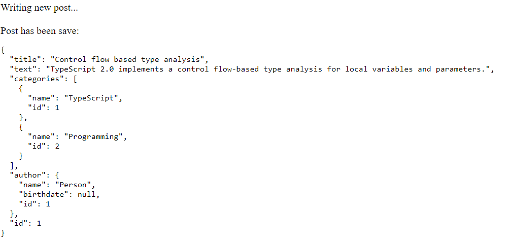

# Example how to use TypeORM with TypeScript in the browser

1. clone repository 
2. run `npm i`
3. run `npm run build`
4. run `npm start`
5. open site in the browser (`http://localhost:3000`)
6. open your web developer console and take a look what queries are executed and what data is persisted

# Screenshots

Logs from your console:

Browser shows basic output:

